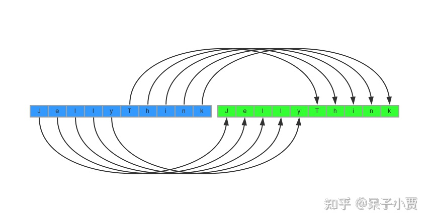
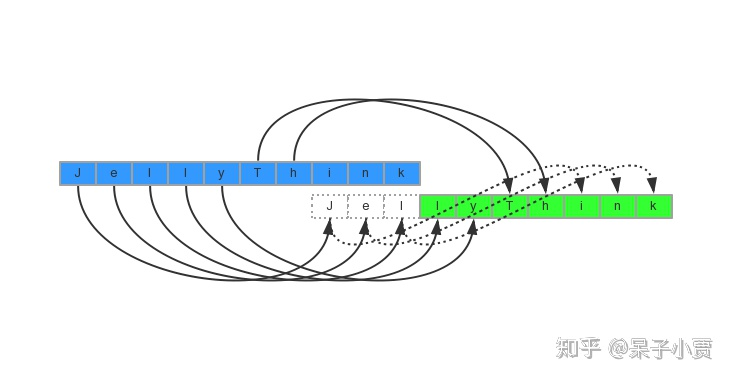

# C++教程：01 - 字符串及内存管理

## 一、字符串

### 1、字符串大小

```prettyprint
char arrar[12] = "hello";       // 12
char str[] = "hello";           // 6
```

## 二、内存管理

### 1、内存拷贝

**memcpy 拷贝内存**
上图，memcpy毫无问题。
下图，memcpy存在问题

那么，如何解决呢？
memcpy变成memmove,but 时间复杂度也会相应提高。
