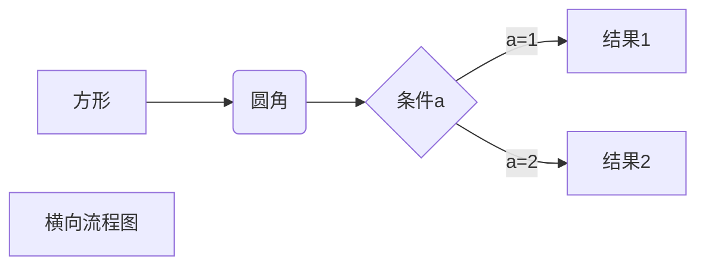

# 华云客户端融合API

## 一、硬件版和软件版分析
### 1、现有硬件版和软件版不同点
1、收发消息的命令码不一致
2、发送消息报的结构体有差异

### 2、主要流程节点
CMsgHandler::Login ==> CMsgHandler::OnLoginSucc

```mermaid
graph LR
A[方形] -->B(圆角)
    B --> C{条件a}
    C -->|a=1| D[结果1]
    C -->|a=2| E[结果2]
    F[横向流程图]
```   
